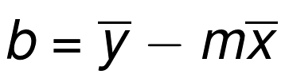
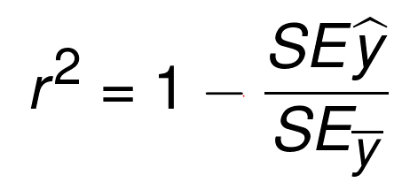
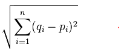
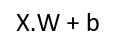
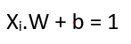
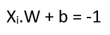
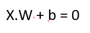
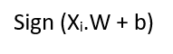

# MachineLearningBasics
Reference  -  Sentdex.
## Calculating the best-fit slope and y-intercept
### The slope, m, of the best-fit line is defined as:

### The y-intercept of the best-fit line is defined as:

## Calculating the Coefficient of Determination
### SE - squared error of the regression line.
### r^2 - determines how "fit" the best-fit line actually is.

## K-Means Alogorithm
### Euclidean Distance

## Support Vector Machines
### Equation of a hyper-plane:

### Equation of a hyper-plane for +ve class support vector:

### Equation of a hyper-plane for +ve class support vector:

### Equation of a decision boudry:

### Equation of classification of feature set:

### Main optimization objective:
* **Minimize || vector(w) ||** 
* **Maximize b**

### Convex Optimiation Problem:
#### key-points:
1. The SVM's optimization problem is a convex problem, where the convex shape is the magnitude of vector w. 
2. Main Objective: find min. ||vector(w)||.
3. This point in convex graph is called **Global Minimum**. 
4. In case of non-linear optimization problems, while taking steps downwards, you might detect you are going back up, so you go back and settle in to a **Local Minimum**.

## Kernels 
1. Kernels are similarity functions that take 2 inputs and return similarity using their **dot** product. 
2. Kernels can be used to perform calculations on non-linear data involving multiple dimensions.

### Hard and Soft Margin Classifiers
1. Hard margin classifiers don't allow any slack/errors.
2. Soft margin classifiers allow us to have some **Slack (𝝃)** or exceptions in the optimization process.
3. 𝝃>=0

